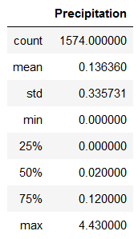

# Surfs Up with Python and Sqlachemy: Analyzing Temperatures for a Surfing Shop

## Overview of Project

### Purpose
The purpose of this analysis is to determine information about temperature trends in different months of the year, in particular for June and December, in Oahu in preparation for starting a surf and ice cream store. By determining the temperatures for the height of summer and winter, it can be determined if the business is sustainable throughout the entire year. The dataset includes daily temperatures in Fahrenheit from a period between 2010 to 2017 which is then queried for the desired months.

## Results

### Project Analysis

Above are descriptive statistics of temperatures. The first is a general summary including count of datapoints, mean, standard deviation, minimum, first quartile, median, third quartile, and maximum for the month of June. The second is for the month of December. 

* In June, from 2010 to 2017, the minimum temperature is 64 degrees, and the maximum temperature is 85 degrees. In December, the minimum temperature is 56 degrees, and the maximum temperature is 83 degrees. So generally, June is generally warmer.

* In June, from 2010 to 2017, the mean temperature is 74.94 degrees. In December, the mean temperature is 71.04 degrees. The first quartile for is 73 degrees for June and 69 degrees for December. The third quartile is 77 degrees for June and 74 degrees for December. By Law of Law Numbers, we can state that this is likely an accurate distribution of temperatures for the two months. Again, we note that June is generally warmer.

* In June, from 2010 to 2017, the standard deviation for temperature is 3.26 degrees while in December, the standard deviation for temperature is 3.75 degrees. So, the temperatures in December tend to vary more by a slight amount.

It is worthwhile to note that the median temperature for June is 75 degrees and the median temperature foe December is 71 degrees. For both months, the mean and median are approximately the same so there is a normal distribution roughly so there is no skewing that could misrepresent the mean as not reflective of the average temperatures due to outliers.

## Summary

### Response to Interest of Opening a Surf and Ice Cream Shop

I would argue that it is viable to open a year-round surf and ice cream shop in Oahu when just looking at temperatures. If average temperatures in June are roughly 75 degrees and average temperatures in December is roughly 71 degrees, then it seems to be the case that it is typically warm enough in both June and December to keep a surf and ice cream shop open year-round. It is the case that June is generally warmer and the shop will likely be more successful in June, but December is also warm as well, albeit slightly lower and with a little more variation in temperature, and likely would also attract some surfers to the shop. This is clear as 75% of daily temperatures in June is 73 degrees or above but 75% of daily temperatures in December is 69 degrees or above which is only slightly chillier.

This can be further confirmed when looking at precipitation when we can determine that Oahu is a generally dry place so surfers typically would want to go surfing all year-round.

Above are descriptive statistics of precipitation. The first is a general summary including count of datapoints, mean, standard deviation, minimum, first quartile, median, third quartile, and maximum for the month of June. The second is for the month of December.

As we can see, the mean precipitation for June is 0.14 inches when rounded to the second decimal place. Its median is 0.02 inches when rounded to the second decimal place so there is some skewing by outliers to the right. For 50% of the daily datapoints in June, it rains 0.02 inches or less. In December, the mean precipitation is 0.22 inches when rounded to the second decimal place. Its median is 0.03 inches when rounded to the second decimal place so there is also some skewing by outliers to the right. For 50% of the daily datapoints in June, it rains 0.03 inches or less. As it does not rain often in Oahu, we can say that it is very unlikely that surfers will be dissuaded from rain.
